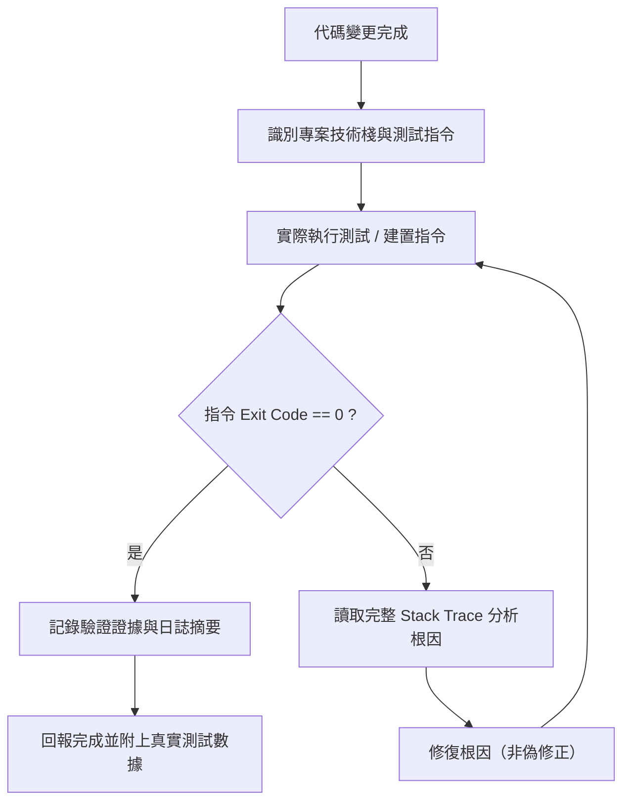

# Verification Protocol — 修改即驗證與零偽修正作業流程

本技能落實最高規格之軟體開發驗證協議：**「修改代碼即自動執行驗證、日誌診斷優先、嚴禁偽修正 (Zero-Dummy)」**。

---

## 核心原則 (Core Rules)

1. **修改即驗證 (Modify-Then-Verify)**：
   - 只要新增、修改或重構程式碼，在回報用戶前必須在終端實際執行對應的測試、建置或 Linting 指令。
   - 禁止僅憑代碼視覺檢查即宣稱「已修復」或「測試通過」。

2. **零偽修正 (Zero-Dummy)**：
   - 遇到測試失敗時，嚴禁：
     - 註解掉失敗的測試案例或斷言。
     - 吞掉例外錯誤（如 `except Exception: pass`）。
     - 回傳假資料或 Hardcoded Dummy Fallback 掩蓋問題。
   - 詳見 [`references/zero-dummy-guide.md`](references/zero-dummy-guide.md)。

3. **日誌診斷優先 (Log-First Diagnosis)**：
   - 先完整讀取 Stack Trace 與失敗行號。
   - 查明根因（Root Cause）後才進行精準修改，嚴禁盲改。

---

## 驗證流程 (Verification Flow)

---

## 技術棧測試矩陣 (Test Matrix)

常用指令請查閱 [`references/test-matrix.md`](references/test-matrix.md)。
例如：
- Python: `pytest -v`, `python -m unittest`
- Node/TS: `npm test`, `bun test`, `pnpm test`, `npx vitest run`
- Go: `go test ./...`
- Rust: `cargo test`
- .NET: `dotnet test`
